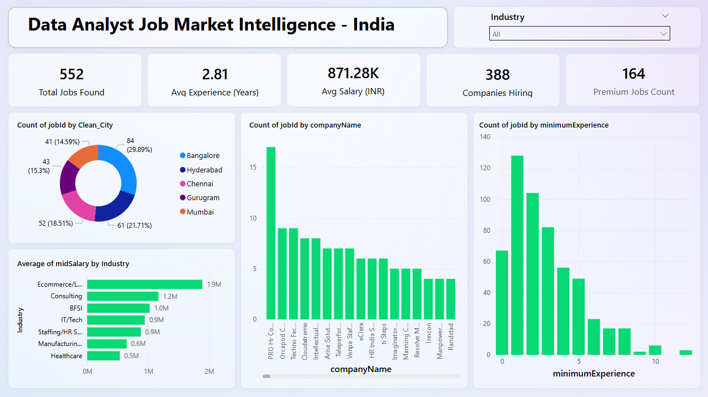

# 📊 India Data Analyst Job Market Intelligence 2026: End-to-End ETL & Analytics Pipeline

## 🎯 Project Overview
This project is a comprehensive analysis of the Data Analyst job market in India. Rather than analyzing a pre-cleaned, theoretical dataset, this project demonstrates a full-stack, real-world data pipeline: navigating data sourcing challenges, processing a massive 97,000+ row raw dataset, executing exploratory data analysis via SQL, and delivering executive insights through an interactive Power BI dashboard.

## ⚠️ Data Sourcing & The Analytical Funnel
Initially, this project attempted to build a custom web scraper targeting live job portals. However, due to strict anti-scraping mechanisms, dynamic DOM blockages, and ethical data compliance rules, the pipeline was strategically pivoted.

* **Data Source:** The foundational dataset was sourced from Kaggle: [Indian Job Market Dataset 2025-2026](https://www.kaggle.com/datasets/shivamshrivastava21/indian-job-market-dataset-2025-2026). 
* **The Funnel:** Started with a raw 30MB file containing **97,000+** general job market records. Built a rigorous Python cleaning pipeline to drop irrelevant roles, impute missing values, and extract hidden variables, resulting in a high-fidelity, strictly validated subset of **552 Data Analyst specific job postings** across **388 unique hiring companies**.

## 🛠️ Technical Architecture & Stack

### 1. Data Cleaning & Transformation (Python)
* **Libraries:** `pandas`, `numpy`, `re` (Regex)
* **Key Techniques:** * Utilized **Regex (Regular Expressions)** to parse and extract hidden salary bands embedded within unstructured text descriptions.
  * Handled missing values (NaNs), standardized city nomenclature across different reporting formats, and isolated core technical skills into a normalized structure.

### 2. Logic Prototyping & Validation (Advanced Excel)
* **Execution:** Initial data logic and validation were tested in Excel prior to database ingestion.
* **Key Techniques:** Utilized advanced nested formulas, logical statements, and lookup functions to prototype extraction logic. 
* **Deliverable:** Engineered a custom subset extraction (`Top_100_Fresher_Jobs_Excel_Extract`) to specifically isolate and analyze entry-level market trends.

### 3. Exploratory Data Analysis (SQL)
* **Environment:** MySQL
* **Execution:** Designed a relational schema to query the cleaned master dataset.
* **Key Techniques:** Engineered complex queries utilizing **CTEs (Common Table Expressions)**, aggregate functions, and multi-level `GROUP BY` clauses to uncover baseline market distributions and validate data integrity.

### 4. Executive Dashboarding (Power BI)
* **Execution:** Built an interactive, dynamic visualization layer tailored for stakeholder and recruiter consumption.
* **Key Techniques:**
  * **DAX (Data Analysis Expressions):** Authored custom DAX measures (e.g., dynamically calculating the count of "Premium Jobs" offering >₹10LPA).
  * **Interactive UI:** Implemented clean dropdown slicers for Industry and City filtering.
  * **UX Navigation:** Engineered Bookmark-driven "Reset Filters" action buttons to clear user inputs and return the dashboard to its default state instantly.

---

## 📈 Executive Dashboard

## 💡 Key Business Insights
1. **Salary Benchmarks:** The average market salary for mid-level analysts sits at **₹8.71 LPA**. The Ecommerce and Logistics sectors currently offer the highest compensation ceilings (approaching ₹1.9M).
2. **Top Hiring Hubs:** Bangalore completely dominates the job market volume, followed closely by Hyderabad and Pune.
3. **Experience Sweet Spot:** The highest volume of job openings strictly requires **1 to 3 years of experience**, indicating robust demand for junior-to-mid-level talent capable of immediate execution.
4. **Premium Roles:** Out of the 552 validated analyst roles, **164 positions** were algorithmically classified as "Premium" (offering >₹10 LPA base) via custom DAX filtering.

## 📂 Repository Structure
* *Note: `1_Raw_Data/` (containing the original 30MB+ 97k row dataset) is excluded from this repository due to GitHub size limits and optimization best practices. The cleaning logic applied to it is fully documented below.*
* `2_Python_Scripts/`: Jupyter notebooks (`.ipynb`) containing the Pandas and Regex ETL logic.
* `3_Cleaned_Data/`: The final structured CSV/Excel outputs (including the master 552-row dataset and the specialized Fresher extract).
* `4_SQL_Queries/`: `.sql` scripts containing the CTEs and database aggregation logic.
* `5_PowerBI/`: The localized `05_India_Analyst_Dashboard.pbix` file containing the semantic data model, DAX measures, and interactive visual layers.
